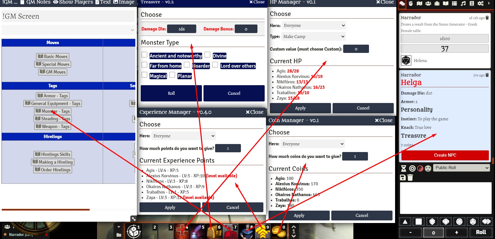
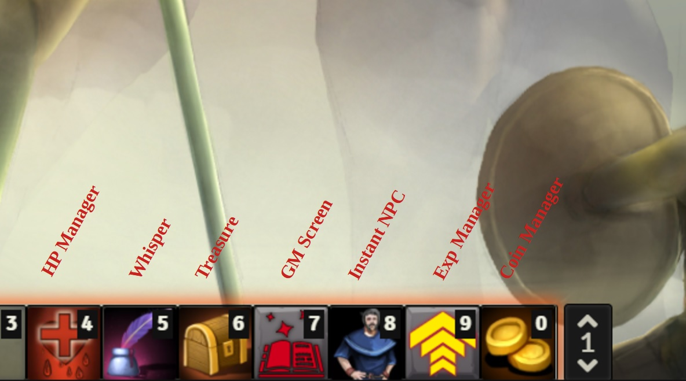

# Macros for Dungeon World
Macros to automate some tasks.

  

  

# How To
This is my macro bar build. It's a suggestion.

## Build

  

## Basics
1. Go to Compendium.
2. Find the Macros compendium.
3. Move the desired macro to the macro bar.

## Attack Assistant
Features
- Rolls damage if success. Offers Expose Yourself Damage in the chat.
- Check for Precise Tag. Uses DEX instead of STR if it is present.
- Check for Damage Tag. Adds the number of it to the weapon damage.
- Change Default Attribute for the move.
Class Features - Detects class features for attack
- Backstab, Herculean Appetites

## Coin Manager
Features
- Select a token and it'll be selected in the combo
- Choose the amount of coins to give or to remove.
- Send coins for everyone

## EXP Manager
Features
- Select a token and it'll be selected in the combo
- Choose the amount of experience to give or to remove.
- Send XP for everyone
- Warn about level available

## Instant NPC
Features
- Roll a NPC and create an NPC Actor.

## Open GM Screen
Features
- Open/close GM Screen

## Set Tokens Bars
Features
- Select all PCs on the scene to:
-- Set HP Bar
-- Always display name and hp
-- Set to disposition Friendly
-- Link actor
-- Set dim vision to 20.

## Treasure
Features
- Choose damage and monster type to roll the treasure table
- Whisper the result to the gm

## Whisper
Features
- Whisper to connected players. GM or Players can use this one.

# How to Install
1. Go to modules and use the link: 
https://raw.githubusercontent.com/brunocalado/dungeon-world-macros/main/module.json

# Can I Help?
Yes. Please.

Do you have a cool macro for DW? Open an issue and I'll check it out.

# Changelog
You can check changes at [CHANGELOG](CHANGELOG.md)

# License
This is released under a Creative Commons Attribution license (CC-BY).